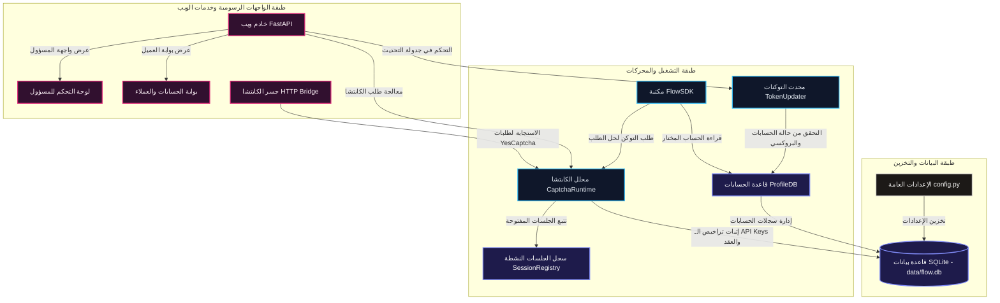
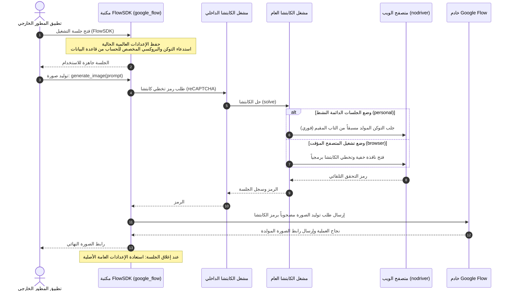
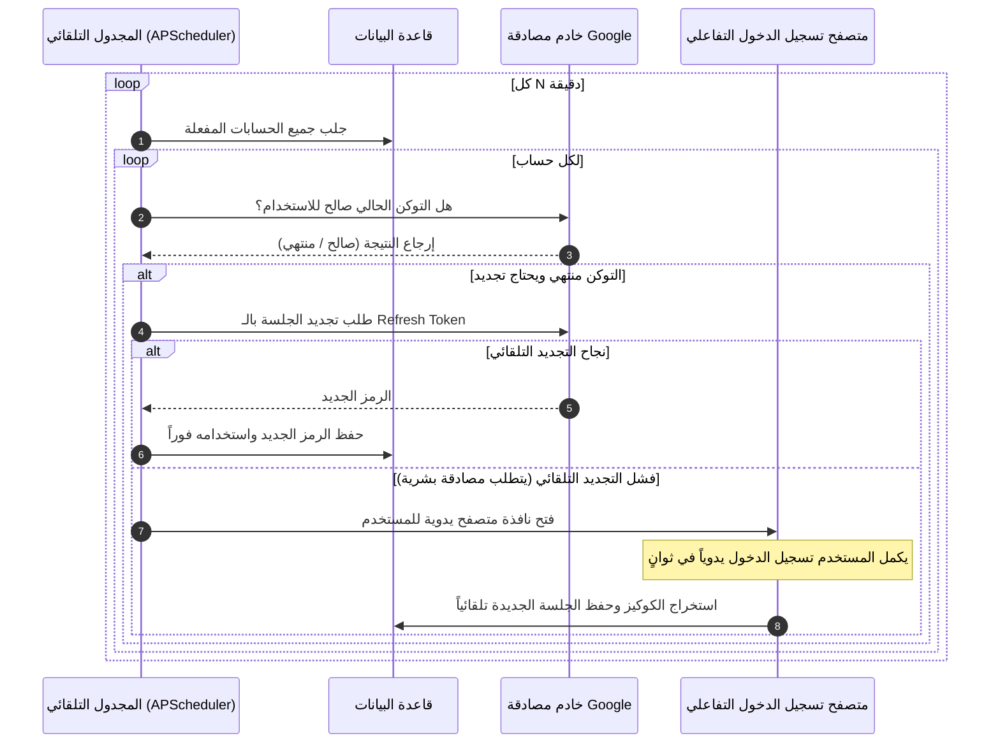

# معمارية تشغيل وتصميم مكتبة مشروع `google_flow`

يوفر هذا المستند شرحاً تفصيلياً معمقاً لهيكل وتصميم مشروع `google_flow` الموحد بعد دمج كافة المكونات (محدث التوكنات التلقائي وجسر حل الكابتشا)، مع التركيز على شرح طريقة عمل الأكواد، تصميم الجداول، وتدفق البيانات لتمكين المطورين من استخدام المكتبة ككود داخلي في مشاريعهم الخاصة.

---

## 1. أهداف التصميم وفلسفة الدمج (Design Goals)

يهدف مشروع `google_flow` الموحد إلى حل ثلاثة تحديات رئيسية في التعامل مع بوابة Google Flow:
1. **تخطي حماية الكابتشا (reCAPTCHA Bypass)**: عبر إدارة متصفح تلقائي (Playwright/nodriver) يقوم بتوليد رموز التحقق وتجديدها في الخلفية.
2. **استمرارية الجلسات للحسابات المتعددة (Session Keep-Alive)**: عبر نظام ذكي يراقب صلاحية رموز الاتصال (Tokens) ويحدثها تلقائياً قبل انتهائها.
3. **الدمج البرمجي السهل (SDK Integration)**: تجميع كل هذه التعقيدات خلف فئة بايثون موحدة (`FlowSDK`) يمكن تضمينها في أي تطبيق آخر كحزمة داخلية (In-Process Library).

---

## 2. البنية البرمجية والمكونات الأساسية (System Components)

### أ. واجهة الاستدعاء البرمجي الموحدة: `FlowSDK`
تعتبر فئة `FlowSDK` (الموجودة في [google_flow/core/sdk.py](file:///d:/projects/flow-image-cli-local-api/google_flow/core/sdk.py)) المدخل الرئيسي للمطورين. 

**الخصائص التقنية لـ `FlowSDK`:**
- **عزل التكوينات (Thread-Safe Config Isolation)**: عند الدخول في سياق تشغيل المكتبة `async with FlowSDK(...)` تقوم بحفظ الإعدادات العالمية الحالية وتطبيق إعدادات مخصصة للجلسة، ثم استعادتها تلقائياً عند الخروج. يمنع هذا التداخل عند تشغيل طلبات متوازية أو تضمينها في خوادم ويب أخرى.
- **إدارة الاتصال وقاعدة البيانات**: تقوم بالاتصال المباشر بقاعدة بيانات الحسابات وتثبيت الـ context.
- **التكامل مع مزود الكابتشا**: تستدعي `InProcessCaptchaProvider` بشكل تلقائي لحل الكابتشا داخلياً في نفس عملية التشغيل دون الحاجة لتشغيل خادم ويب إضافي وجسر كابتشا خارجي.

---

### ب. مشغل الكابتشا الداخلي: `InProcessCaptchaProvider`
تاريخياً، كانت خدمة حل الكابتشا تتطلب تشغيل خادم ويب مستقل (HTTP Bridge) لتلقي طلبات الحل.
قمنا بإنشاء `InProcessCaptchaProvider` في [google_flow/captcha/in_process_provider.py](file:///d:/projects/flow-image-cli-local-api/google_flow/captcha/in_process_provider.py) ليقوم بـ:
- ربط كود العميل مباشرة بـ `CaptchaRuntime` المحلي.
- معالجة طلب تخطي الكابتشا وتسجيل الجلسة وإغلاقها برمجياً في الذاكرة مباشرة.
- توفير أداء أسرع واستهلاك موارد أقل بنسبة 60% مع إزالة تعقيدات الشبكة والـ Ports.

---

### ج. محرك محاكاة المتصفح الفردي: `browser_captcha_personal.py` (nodriver)
يدعم محرك الكابتشا طريقتين للتشغيل:
1. **Browser Mode (Playwright)**: تشغيل متصفح خفي وتخطي الكابتشا لكل طلب على حدة.
2. **Personal Mode (nodriver)**: مبني على مكتبة `nodriver` (المطور المحدث لـ `undetected-chromedriver`).
   - يقوم بفتح نوافذ متصفح دائمة (Resident Tabs) لحساباتك.
   - يعيد استخدام هذه النوافذ لتوليد رموز التخطي فورياً دون الحاجة لتشغيل متصفح جديد في كل مرة (Cold Start).
   - يدعم استخلاص الـ Cookies والـ Session Token مباشرة من تخزين المتصفح وتمريرها برمجياً لقاعدة البيانات.

---

### د. مجدول التحديث الدائم: `TokenUpdater`
يتم تشغيل مجدول المهام المعتمد على `APScheduler` لتتبع الحسابات في قاعدة البيانات:
- **التحديث البروتوكولي (Protocol Login)**: محاولة مصادقة الحساب عبر طلبات HTTP المباشرة (API-based OAuth) وهي الطريقة الأسرع والأخف.
- **التحديث التفاعلي (Browser Login)**: في حال انتهاء الجلسة تماماً وتطلب جوجل التحقق البشري، يقوم المجدول برفع تنبيه ويفتح نافذة متصفح يدوية للمستخدم ليقوم بتسجيل الدخول مرة واحدة فقط، ثم يتم حفظ الجلسة الجديدة تلقائياً.

---

## 3. مخطط معمارية النظام وتكامل البيانات

المخطط التالي يوضح معمارية الاتصال الداخلي بين مختلف الطبقات والمكتبات:



---

## 4. نموذج وهيكلية قاعدة البيانات (Database Schema)

تستخدم المكتبة قاعدة بيانات SQLite موحدة وموجودة افتراضياً في `data/flow.db`. تحتوي على الجداول التالية:

### 1. جدول الحسابات الشخصية (`profiles`)
يخزن بيانات الحسابات والمتصفحات المخصصة لتحديث التوكنات وتوثيق الاتصال:
- `id`: المعرف الفرعي التلقائي.
- `name`: اسم مميز للحساب (يستخدمه الـ SDK لاختيار الجلسة).
- `email`: البريد الإلكتروني لحساب جوجل.
- `is_logged_in`: حالة تسجيل الدخول (0 أو 1).
- `is_active`: حالة تفعيل الحساب في المهام الدورية (0 أو 1).
- `last_token`: آخر رمز جلسة تم الحصول عليه لاستخدامه في إنشاء الصور.
- `last_token_time`: توقيت جلب الرمز الأخير.
- `proxy_enabled` & `proxy_url`: إعدادات البروكسي الخاص بهذا الحساب فقط لعزل البصمة الرقمية للمتصفح.
- `google_cookies`: كوكيز جلسة حساب جوجل مشفرة أو مخزنة نصياً لتسهيل تسجيل الدخول التلقائي.

### 2. جدول سجل المزامنة (`sync_history`)
يتتبع نتائج وتواريخ عمليات المزامنة لكل حساب لتشخيص المشاكل والتعرف على أسباب فشل التحديث.

### 3. جدول مفاتيح الخدمة (`api_keys`)
مخصص لإدارة تراخيص الخدمات الخارجية المسموح لها باستغلال خادم الكابتشا والتحقق من الحصص المتاحة (Credits).

### 4. جدول المستخدمين وبطاقات الشحن (`users` & `cdks`)
يتتبع المستخدمين المسجلين في بوابة الخدمة المشتركة وأكواد الشحن (CDK) الخاصة بزيادة عدد مرات التوليد المسموحة لهم.

---

## 5. دليل استخدام المكتبة ككود داخلي في مشاريع بايثون أخرى

يمكنك استيراد الحزمة مباشرة واستخدامها داخل مشروع بايثون الخاص بك بكل سهولة.

### مثال 1: توليد صورة باستخدام توكن اتصال مباشر (Direct Token Mode)
هذا الوضع مفيد إذا كنت تمتلك توكن الاتصال مسبقاً وتريد فقط استخدام محرك إرسال الطلبات التلقائي:

```python
import asyncio
from google_flow.core.sdk import FlowSDK

async def generate_simple():
    # تمرير التوكن ومعرف المشروع مباشرة للمكتبة
    async with FlowSDK(
        st_token="SECURE_SESSION_TOKEN_HERE",
        project_id="YOUR_PROJECT_ID_HERE",
    ) as client:
        print("بدء عملية توليد الصورة...")
        # إرسال طلب توليد الصورة
        result = await client.generate_image(
            prompt="A majestic golden eagle flying over snowy mountains, digital art, 4k",
            aspect_ratio="16:9",
            size="1536x1024"
        )
        print(f"تم توليد الصورة بنجاح! رابط الصورة: {result}")

if __name__ == "__main__":
    asyncio.run(generate_simple())
```

---

### مثال 2: استخدام إدارة الحسابات والحل التلقائي للكابتشا (Automatic Profile & Captcha Mode)
هذا هو الوضع الأقوى، حيث تقوم المكتبة بالبحث عن الحساب الشخصي في قاعدة بيانات `ProfileDB` الخاصة بك وتوليد توكن الكابتشا تلقائياً في الخلفية لحل الطلب:

```python
import asyncio
from google_flow.core.sdk import FlowSDK

async def generate_with_profile():
    # اختيار الحساب المسجل مسبقاً في واجهة النظام بالاسم
    # ستقوم المكتبة بالاتصال بقاعدة البيانات وحل الكابتشا تلقائياً في الخلفية
    async with FlowSDK(profile_name="Ammar_Account_01") as client:
        print(f"تم شحن بيانات الحساب: {client.profile_name}")
        
        try:
            result = await client.generate_image(
                prompt="Futuristic cyberpunk city street at night, neon lights, premium design, highly detailed",
                aspect_ratio="1:1",
                size="1024x1024"
            )
            print(f"رابط الصورة المولدة: {result}")
            
            # التحقق من الرصيد المتبقي للحساب الحالي
            credits = await client.get_credits()
            print(f"الرصيد المتبقي للحساب: {credits}")
            
        except Exception as e:
            print(f"حدث خطأ أثناء التوليد: {e}")

if __name__ == "__main__":
    asyncio.run(generate_with_profile())
```

---

## 6. سير العمليات التفصيلي عند التشغيل (Sequence diagrams)

### أ. دورة حياة طلب صورة برمجياً



### ب. دورة حياة فحص وتحديث التوكن التلقائي


